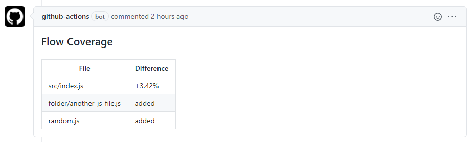

# Flow Coverage Compare

Github action to compare flow coverage on a PR to the base branch.

Running this action will create a comment like this on your pull request:


## Usage

You'll want to add this job to one of your [workflow files](https://docs.github.com/en/actions/configuring-and-managing-workflows/configuring-a-workflow). Below are examples of sample workflow files using this action. Additionally, in order to use this action, you'll want to ensure you can run flow like `yarn run flow` or `npm run flow` in your repository.

### Action inputs

The possible inputs for this action are:

| Parameter         | Description                                                                                                                                       | Default        |
| ----------------- | ------------------------------------------------------------------------------------------------------------------------------------------------- | -------------- |
| `github-token`    | The GitHub authentication token                                                                                                                   | `GITHUB_TOKEN` |
| `package-manager` | The package manager your repo uses - either `yarn` or `npm`                                                                                       | `yarn`         |
| `path`            | The path to your `.flowconfig`                                                                                                                    |                |
| `pattern`         | The regex pattern used to determine which files to run flow on                                                                                    | `^.*.js$`      |
| `threshold`       | The number of percentage points _down_ where this job will fail - not specifying this input will cause the job to always pass if run successfully |                |

### Examples

**"Copy paste" config**

This config uses all the defaults, specifying nothing - it assumes you are using yarn, want to check all `.js` files, always want the check to pass, and just make a comment on your PR with the flow comparison.

Note: The steps before `Run check` in this workflow are important! They checkout your head branch from your PR, and the base branch it wants to merge into.

```yml
name: Flow Coverage Compare

on: [pull_request]

jobs:
  check:
    runs-on: ubuntu-latest
    steps:
      - name: Checkout head branch
        uses: actions/checkout@v2
        with:
          path: head
      - name: Checkout base branch
        uses: actions/checkout@v2
        with:
          path: base
          ref: ${{ github.base_ref }}
      - name: Install dependencies
        run: |
          cd head
          yarn
          cd ../base
          yarn
      - name: Run check
        uses: jackieo5023/flow-coverage-compare@v1
```

**Customizable config**

This config specifies 4 things:

- You are using `npm`
- Your flow config is under the path `client/`
- You want to check _only_ the files under the `client/src` directory, ending in `.js`
- You want to fail the job if any file checked has a decline in flow coverage greater than or equal to 10%

Note: You still need to include the steps before `Run check` with this workflow!

```yml
name: Flow Coverage Compare

on: [pull_request]

jobs:
  check:
    runs-on: ubuntu-latest
    steps:
      - name: Checkout head branch
        uses: actions/checkout@v2
        with:
          path: head
      - name: Checkout base branch
        uses: actions/checkout@v2
        with:
          path: base
          ref: ${{ github.base_ref }}
      - name: Install dependencies
        run: |
          cd head
          npm install
          cd ../base
          npm install
      - name: Run check
        uses: jackieo5023/flow-coverage-compare@v1
        with:
          package-manager: npm
          path: client/
          pattern: ^client/src\/.*.js$
          threshold: 10
```
